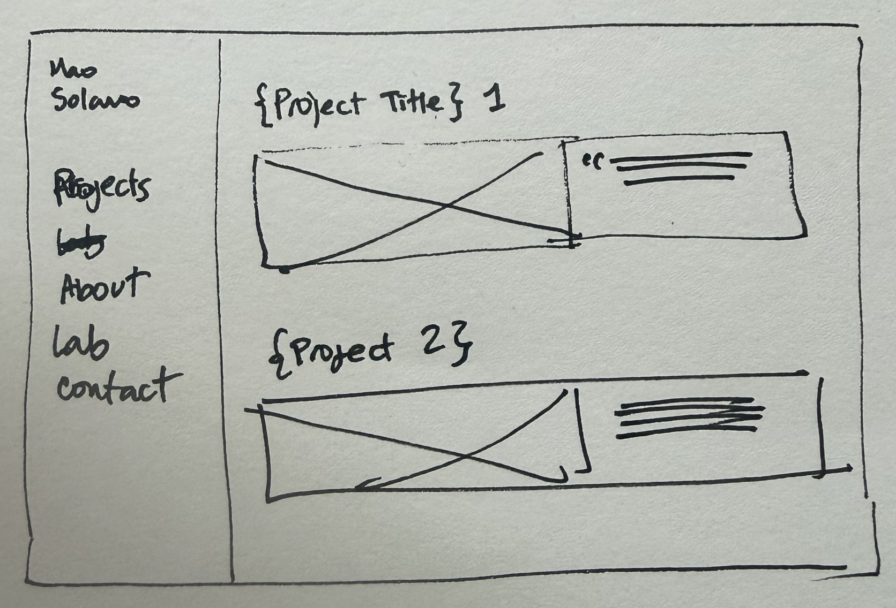

I had been planning this portfolio for weeks. The initial plan had five days, four audiences and a hero section. On a Sunday afternoon I replaced it with one rule: keep it simple, and publish in two hours.

## 1. Start with a sketch

Two columns on paper: my name and the menu on the left, the projects on the right. That drawing was the whole design brief. Nothing in the finished site contradicts it.

## 2. Let the CV be the content

I gave Claude my CV and the sketch, and asked for a plan, a folder structure and a prompt for Claude Code.

I wrote almost no new copy. The profile, the experience and the three projects came from text I already had.

## 3. Answer four questions

Language, one personal line, my email, and what was already sitting on the domain. Those answers were all that stood between the plan and execution.

## 4. Make a few decisions and stop

For the basic design elements I took the short path: I picked a font pairing from Google Fonts and an 8-colour palette I had put together on [Coolors.com](https://coolors.co/).

When I asked Claude to build a style guide out of those elements, a rule came with it: yellow is for highlighting, never for text, because it cannot be read on a cream background.

Halfway through I changed my mind and swapped both typefaces. It cost about a minute. Every size, colour and space was already a token, so the change was two lines in one file and nothing else moved. That is the entire argument for building the tokens before the pages.

## 5. Prepare the files

I took screenshots of each of the three recent projects I have worked on, with the goal of hitting the deadline and publishing in record time.

In a next iteration I will work on the content of each project, to show the process I went through with each one.

## 6. Build

The build ran in a fixed order: tokens and layout, then the Spanish pages, then a full stop so I could read the Home before anything else was written. English, the style guide and this post came afterwards.

The corrections were small and made on quick calls, aimed at getting to the result. A stray space before a comma in the experience list. A download link pointing at a CV filename I had changed an hour earlier.

## 7. Publish

The real delay was not the build. When I went to publish, Vercel reported a finished, green, successful deployment that had built nothing at all: it took zero seconds and served a 404. The GitHub connection reported itself as already connected and had never once fired.

Both looked completely fine from the dashboard. The only check that caught either one was opening the live URL and reading what came back. The site went live at 16:38, eight minutes past the deadline.

## What I left out

Case studies, a contact form, animations, dark mode, shadows, rounded corners, a proper social image, and most of my original plan.

## What I learned

- **Better done than perfect**: my whole life as a designer I have carried self-limiting thoughts, afraid the result would not be perfect. It reads half obvious and half silly written down, but the feeling has been real.
- ***Build fast, iterate faster***: this was the mantra that got me past the fear of not having a "perfect" site. If what I want is to start conversations with recruiters and connect with opportunities, a working version I keep iterating on serves me better.
- **Constraints widen your reach**. The constraints I wrote into the brief did more work than the brief itself. *Do not invent any facts about me.* *Stop and show me the Home before you continue.* Those two sentences are the reason I spent the afternoon building instead of reviewing.
